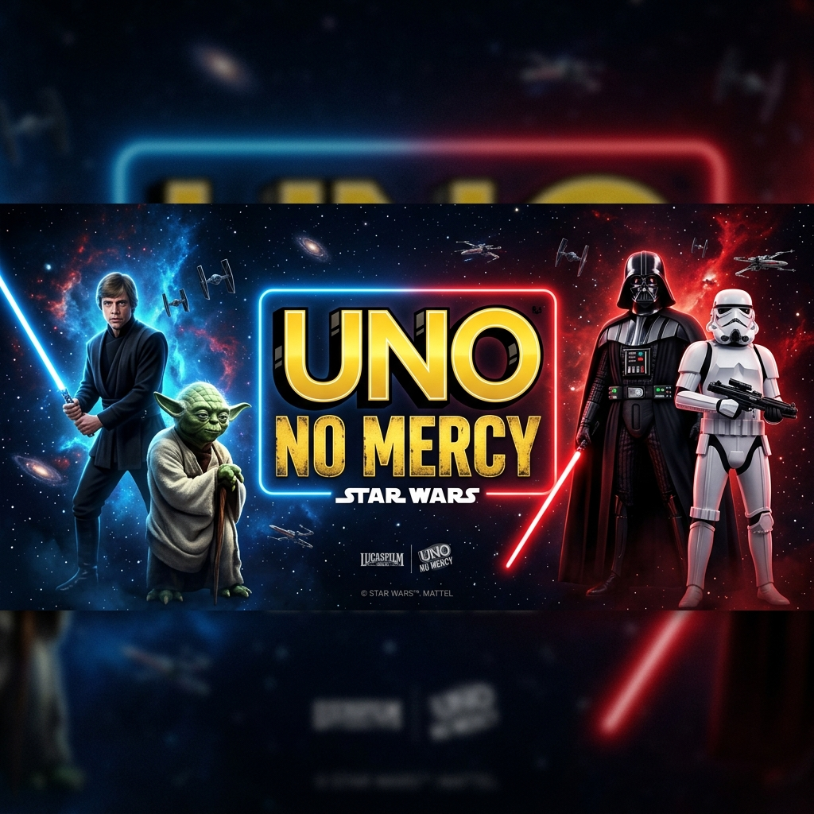

# 🌌 Uno No Mercy: Star Wars Edition



Uma recriação web ultra-moderna, fluida e implacável do jogo de cartas mais brutal da Mattel, agora ambientada em uma galáxia muito, muito distante. **Uno No Mercy: Star Wars Edition** combina as regras extremas do "Show 'Em No Mercy" com uma estética sci-fi premium, hologramas interativos e uma arquitetura de código de ponta.

---

## 😈 Sem Misericórdia, Sem Limites

Diferente do Uno clássico, esta versão foi projetada para ser rápida, estratégica e punitiva. Aqui, a Força nem sempre estará com você.

### 🔥 Mecânicas Implacáveis:
- **Regra da Misericórdia (Mercy Rule)**: Se um jogador atingir **25 cartas na mão**, ele é eliminado instantaneamente por excesso de carga de energia.
- **Acúmulo de Punição (Stacking)**: Responda a um +2 com +2 ou superior, ou a um +6 com +6 ou +10. O acumulado cresce exponencialmente até que alguém não consiga revidar.
- **Comprar até Jogar**: Não há limite de compra. Você continuará drenando o deck até encontrar uma carta que possa ser jogada.
- **Cartas de Ação Brutais**:
  - **7 (Troca de Mão)**: Escolha um oponente e troque seu arsenal inteiro com o dele.
  - **0 (Rodar Mãos)**: Todos os jogadores passam suas cartas adiante, seguindo o fluxo da Força.
  - **Pular Todos**: Execute seu movimento e ganhe um novo turno imediatamente, deixando todos para trás.
  - **Descartar Tudo**: Limpe todas as cartas de uma mesma cor da sua mão de uma só vez.

---

## 🎨 Design & Experiência do Usuário (UX)

O projeto foi construído para proporcionar uma experiência imersiva e visualmente deslumbrante:

- **Interface Holográfica**: Modais e painéis com estética de hologramas, linhas de scan e efeitos de brilho neon.
- **Animações de Trajetória**: As cartas possuem movimento físico real da mão do jogador até o monte de descarte através de `layoutId`.
- **Modo Dark Premium**: Paleta de cores cuidadosamente selecionada (Sith Red, Jedi Blue, Yoda Green, Star Yellow) sobre um fundo de espaço profundo.
- **Lobby Dinâmico**: Seleção de personagens icônicos e ajuste de bots com feedback visual em tempo real.

---

## 🏗️ Arquitetura Técnica

O sistema foi refatorado para seguir os mais altos padrões de desenvolvimento moderno:

- **Modularização**: Interface dividida em componentes específicos (`Lobby`, `GameBoard`, `PlayerDashboard`, `Modals`).
- **Hooks Customizados**: Lógica de jogo isolada em `useUnoGame` e inteligência artificial dos bots em `useBotAI`.
- **Otimização**: Uso de `React.memo` para renderização de alta performance e gerenciamento eficiente de estado.
- **Tecnologias**: React 18, TypeScript, Framer Motion, Lucide Icons e Vite.

---

## 🚀 Como Executar o Projeto

1. **Clone o repositório:**
   ```bash
   git clone https://github.com/TauaneAlessandra/uno-no-mercy-web.git
   ```
2. **Instale as dependências:**
   ```bash
   npm install
   ```
3. **Inicie o servidor de desenvolvimento:**
   ```bash
   npm run dev
   ```
4. **Acesse no navegador:** `http://localhost:5173`

---

Desenvolvido com a força de 💢 por [Tauane](https://github.com/TauaneAlessandra)
